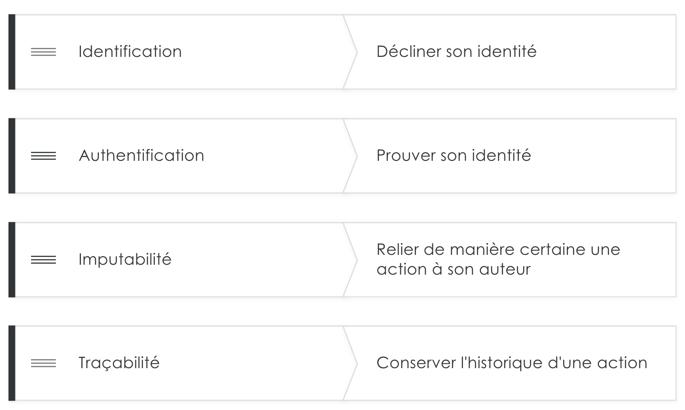
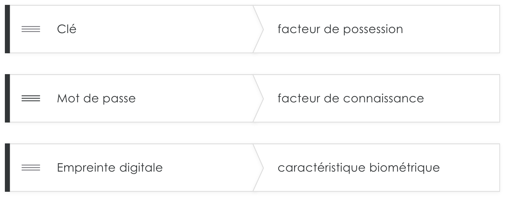

# Les principes de l'authentification

## Introduction

Avec la multiplication des services en ligne (messagerie, sites marchands, hébergement de documents, réseaux sociaux, etc.), nous devons aujourd’hui gérer de nombreux mots de passe.
En obtenant le mot de passe d’une personne, l’attaquant prend possession du moyen d’accéder à des services et informations utiles. Un véritable sésame pour une personne malveillante !
Comment les choisir ? Comment les retenir ? Quels sont les risques en cas de vol de mot de passe et que faire ?

Dans cette unité, nous allons tenter de répondre à quelques-unes de ces questions et de vous donner quelques bonnes pratiques à adopter.

## Objectif de l'authentification

Lorsque vous vous connectez sur un service, il vous est demandé de vous **authentifier**.
Pour cela on vous demande généralement de communiquer un nom d'utilisateur (l'identité) et un mot de passe.
L’authentification est une étape de contrôle indispensable puisqu’elle vise à vérifier l’identité communiquée par un utilisateur lors de sa connexion sur un service.

**Le principe d'authentification** est une brique essentielle pour permettre la mise en place des mécanismes de **sécurité** des services en ligne.
C'est le cas notamment du **contrôle des accès**, qui permet de gérer les autorisations pour accéder à vos données en s'appuyant sur l'identité authentifiée.  

Pour accéder à vos données, deux principes différents sont ainsi mis en œuvre : le principe d'authentification et le principe d'autorisation. 
Par exemple, lorsque vous avez saisi votre identifiant et votre mot de passe sur votre service de messagerie en ligne (**principe d'authentification**), vous pouvez consulter vos propres messages mais pas ceux reçus par d'autres utilisateurs (principe d'autorisation). 
Et inversement, ces autres utilisateurs ne peuvent pas consulter vos messages. 

#### OBJECTIFS

Le principe d'authentification est également utilisé pour assurer l'imputabilité (c’est-à-dire pour apporter la preuve de qui a fait quoi) et la traçabilité des actions (c’est-à-dire conserver l'historique des actions).
Ainsi, lorsque vous télé-déclarez vos impôts en ligne par exemple, l'imputabilité permet de faire le lien entre votre déclaration et votre identité authentifiée.

La traçabilité, quant à elle, permet de connaître l'heure à laquelle vous avez soumis votre déclaration d'impôts.

<!-- { align=left , width=50%} -->
<!--  -->

## Facteurs de l'authentification

#### OBJECTIFS

L'authentification consiste à apporter la **preuve de son identité** mais il existe plusieurs façons de la prouver.
Celles-ci se répartissent en plusieurs catégories : on parle de **facteurs d'authentification**.
Les différents facteurs sont la **connaissance, la possession ou encore les caractéristiques biométriques**.

**Les facteurs de connaissance** sont aujourd’hui la catégorie la plus répandue.
Cette catégorie regroupe les preuves correspondant à « ce que je connais ».
**Ces preuves peuvent être par exemple** :

*    Un mot de passe.
*    Un code PIN de carte à puce (ex : un code de carte bancaire).
*    La réponse à une question secrète et connue de vous seul(e).
*    Un schéma de déverrouillage (ex : déverrouillage des smartphones).

Soyez vigilant lorsque vous définissez des mots de passe.
Vous devez faire attention à définir des mots de passe complexes (dont on parlera dans l’unité 3 de ce module), et à vous assurer que les réponses à vos questions secrètes ne sont pas trivialement retrouvables.
En effet, si vous choisissez comme question secrète « Quel est le nom de jeune-fille de ma mère ? » la réponse peut être très facile à trouver par un attaquant, le risque de découverte de votre mot de passe sera donc plus grand.

La deuxième catégorie regroupe **les facteurs de possession** c’est-à-dire les preuves qui correspondent à « ce que je possède ». 
Dans nos activités professionnelles, **il peut s’agir de** : 

*    Un téléphone portable (ex : un code à usage unique envoyé par SMS).
*    Une carte à puce (ex : carte bancaire, passeport électronique, carte vitale).
*    Un badge, une clé USB de sécurité.
*    Un générateur de mot de passe à usage unique (ex : certaines banques fournissent un boîtier pour valider des opérations bancaires comme les virements), etc.

Enfin, la troisième catégorie regroupe les preuves qui correspondent à « ce que je suis ».
Il s’agit d’**éléments biométriques (ou inhérents) tels que** :

*    Une empreinte digitale.
*    Une empreinte rétinienne.
*    La structure de la main.
*    La structure du visage.
*    La voix.
*    etc.

L'avantage de cette méthode est que l'utilisateur a toujours sur lui ses « codes d'authentification » et ne peut pas les perdre ou les oublier. 
Cependant, à l’inverse d’un facteur de connaissance ou de possession, les éléments biométriques sont fixes, ce qui peut poser des problèmes vis à vis de la vie privée.

#### 1 FACTEUR = AUTHENTIFICATION SIMPLE

L'authentification électronique par identifiant et mot de passe met en œuvre un unique facteur d'authentification, à savoir le mot de passe qui rentre dans la catégorie des facteurs de connaissance : on parle alors d'authentification simple.

#### PLUSIEURS FACTEURS = AUTHENTIFICATION FORTE

Lorsque le mécanisme d'authentification met en œuvre plusieurs facteurs d'authentification, on parle alors d'authentification forte.
L’authentification forte mêle ainsi différents types de facteurs d’authentification comme la connaissance associée à la possession.
Ce type d'authentification est souvent utilisé pour se protéger des faiblesses pouvant être liées aux mots de passe.
Aujourd’hui, il est en effet assez répandu de pouvoir activer un deuxième facteur d'authentification pour accéder à sa messagerie électronique et de devoir saisir un code reçu par SMS après avoir entré son mot de passe.

<!-- { align=left } -->

# Limites des facteurs d'authentification

## LA BIOMÉTRIE

De toutes les méthodes d’authentification vues ensemble, aujourd’hui, la biométrie est sans doute la méthode la plus prometteuse, mais aussi la plus délicate à mettre en œuvre pour plusieurs raisons.

## LIMITES DE LA BIOMÉTRIE

Il existe toutefois plusieurs limites à la biométrie.
Tout d'abord, la biométrie coûte cher et nécessite de lourds moyens pour être mise en place.
Ensuite, elle pose des problèmes sur l'aspect juridique du fait de stocker les caractéristiques morphologiques des personnes.

Notez également que certaines techniques d'authentification biométriques sont plus susceptibles d'être contournées que d'autres.
Par exemple, les techniques courantes de reconnaissance du visage peuvent être mises à mal par une simple photo.
Et c’est sans compter les éventuels problèmes d’accès qui pourraient survenir avec une voix enrouée ou encore des mains brûlées…

L'un des axes de recherche de la biométrie porte donc sur la **multimodalité**, c'est-à-dire la combinaison de plusieurs méthodes d'identification par voie biométrique.
**Là encore les coûts restent aujourd’hui un facteur limitant pour sa mise en place**.

#### EXEMPLE EN BELGIQUE

Il est important de noter que ce système connait également quelques dérives à la croisée entre **les facteurs de possession et biométrique**.
En Belgique par exemple, certains employés ont accepté de se faire implanter **des puces sous la peau**.
Notons toutefois que ce type de solutions a peu de chance de voir le jour en France puisqu’il est, entre autres, contraire à l’application du **règlement général sur la protection des données personnelles (RGPD)**.

En effet, ces bases de données sont à rapprocher de celles utilisées par la police et sont donc soumises à des lois très strictes. 

# Les risques liés aux mots de passe

## Présentation

Le mot de passe est aujourd’hui le mode d’authentification **le plus répandu**.
En effet, c’est le mode d’authentification le plus simple à mettre en place sur nos services quotidiens.

Mais ce mot de passe n’est pas exempt de __risques__.

## Divulgation

Même s’il n’élimine pas l’ensemble des risques, le principe d'authentification permet toutefois de **réduire les risques** d'usurpation d'identité.
Les risques peuvent varier en fonction du type d'authentification et de la nature des preuves apportées.
En particulier, un mot de passe est un élément secret que **vous seul** devez connaître car il conditionne l'accès à vos données et services en ligne. 
Le risque principal lié à son utilisation est donc sa **divulgation** à un tiers qui pourrait en faire un usage malveillant. 
Les causes de **divulgation** peuvent être multiples, de la négligence à la malveillance.

## Négligeance

On parle de divulgation par négligence dans les cas suivants :

* Utilisation d'un **mot de passe faible** (ex : 0000, 123456, motdepasse) ;
* Inscription du mot de passe sur un **support accessible** à un tiers (post-it sous le clavier, tableau blanc, etc.) ;
* **Diffusion** à un tiers (collègue, ami, opérateur de service informatique, mot de passe envoyé par email, etc.) oralement ou par écrit (papier, mail, etc.) ;
* Authentification sur un service via un **protocole non sécurisé** tels que HTTP, IMAP, POP3, etc. au lieu de HTTPS, IMAPS, POPS ;
* Utilisation d'un ordinateur/smartphone qui ne soit pas de confiance et potentiellement **infecté** (cybercafé, ordinateur en libre accès dans un hôtel, etc.) ;
* Mot de passe enregistré sur le navigateur internet **sans protection**.

## Malveillance

La divulgation de mot de passe peut également faire suite à un acte de malveillance.

Il peut s’agir :

* D’une authentification sur un service illégitime (hameçonnage ou phishing, dont on parlera dans l’unité 2 de ce module)
* D‘une attaque par ingénierie sociale (utilisation de vos données personnelles pour vous piéger)
* D’une attaque par force brute ou de la divulgation d’une base de données de mots de passe d’un service mal sécurisé.

## Ces différentes causes de divulgation seront abordées en détail dans la suite de ce cours. 

Gardez en tête que lorsque votre mot de passe a été divulgué, il perd son **caractère confidentiel**.
Un individu malveillant peut alors **usurper votre identité** sur un service en ligne et effectuer des actions en votre nom.
Les conséquences varient en fonction du type de service impacté et des objectifs des **individus malveillants** :

* **Compromission** de messages personnels sur votre messagerie électronique ;
* **Destruction** de données ;
* **Publication** de messages ou photos préjudiciables sur vos réseaux sociaux ;
* **Achats** sur des sites de vente en ligne (certains sites proposent en effet de conserver votre numéro de carte bancaire) ;
* **Virements bancaires** sur le site de votre banque, etc. ;

## Conclusion

L'usurpation d'identité peut avoir des **conséquences importantes** pour vous et par extension pour votre **entreprise**.
C’est pourquoi, si vous êtes victime d'usurpation d'identité, **il est nécessaire de suivre les conseils suivants** :

Pour limiter ces risques, il convient d'appliquer un certain nombre de bonnes pratiques que vous découvrirez dans la suite de votre parcours.
